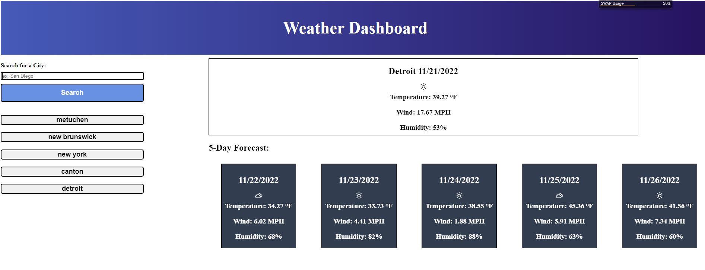

# WeatherDashboard

## Description

A weather dashboard the pull the weather of your city of choice.  It displays the current weather as well as the next five days.  It pulls from the Open Weather Map api. The website is also structured with responsive design as a priority, so it is mobile friendly.

## Usage

Type in the city you would like to search the weather for in the search input box.  The website will feed it into a coordinates function to return the geographical coordinates and feed that into a function to fetch your five day forecast.  The web page is responsively designed and is intended to be mobile friendly.

## Demo

Here is a screenshot of the deployed site 
The live site is deployed [here](https://humzashaukat.github.io/WeatherDashboard/)

## Credits 

Icons were used and compiled by Erik Flowers on his deployed [site](http://erikflowers.github.io/weather-icons)

## License

An MIT License is used